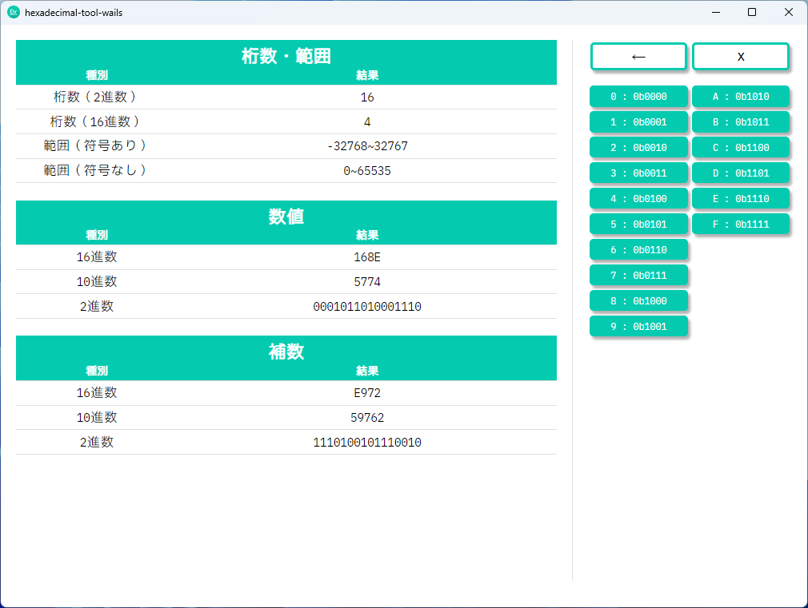

# hexadecimal-tool-wails

## About

16 進数を入力すると，16 進数・10 進数・2 進数でその数と補数が表示されるだけのソフト．

## Usage

1. ボタンを押して任意の 16 進数を入力
1. 補数等必要な情報を確認

## Execution Environment

以下でビルド可能（[こちら](https://wails.io/ja/docs/gettingstarted/building)を参照）

-   Windows
-   Mac
-   Linux

## Framework, Language

-   Wails v2.7.1
-   Go v1.21.5
-   React.js v18.2.0
-   TypeScript v4.6.4
-   Node.js v20.10.0
